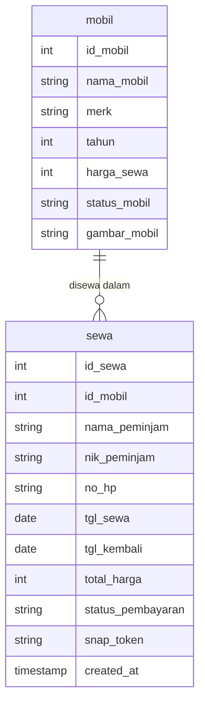

# Laporan Analisis Sistem AutoRent

Laporan ini menyajikan analisis mendalam mengenai struktur sistem, database, dan fitur-fitur yang terdapat pada aplikasi **AutoRent** (Sistem Rental Mobil).

---

## 1. Deskripsi Proyek

**AutoRent** adalah sebuah aplikasi web manajemen persewaan/rental mobil yang dirancang menggunakan arsitektur monolitik berbasis **PHP native** dan database **PostgreSQL**. Aplikasi ini memfasilitasi kebutuhan admin rental mobil dalam mengelola armada kendaraan secara digital, mencatat pemesanan pelanggan, serta memantau status persewaan secara real-time.

Untuk memberikan pengalaman pengguna yang unggul, AutoRent dilengkapi dengan antarmuka (UI/UX) modern berkonsep semi-glassmorphism, transisi halus, micro-interactions, serta integrasi langsung dengan **Payment Gateway Midtrans (Snap)**. Hal ini memungkinkan pelanggan melakukan pembayaran sewa mobil secara cashless melalui berbagai metode pembayaran elektronik (Virtual Account, E-Wallet, dll.).

---

## 2. Tabel & Relasi Database

Aplikasi ini menggunakan database PostgreSQL bernama `rental_mobil`. Struktur data disimpan dalam dua tabel utama yang saling berelasi: **`mobil`** dan **`sewa`**.

### A. Struktur Tabel

#### 1. Tabel `mobil`
Tabel ini berfungsi untuk menyimpan inventaris kendaraan (armada) yang dimiliki oleh rental mobil.

| Nama Kolom | Tipe Data | Atribut | Deskripsi |
| :--- | :--- | :--- | :--- |
| `id_mobil` | `SERIAL` | `PRIMARY KEY` | ID unik untuk setiap mobil (Auto Increment) |
| `nama_mobil` | `VARCHAR(100)` | `NOT NULL` | Nama model/tipe mobil (misal: Avanza Veloz, Hyundai Creta) |
| `merk` | `VARCHAR(50)` | `NOT NULL` | Pabrikan kendaraan (misal: Toyota, Honda, Hyundai) |
| `tahun` | `INT` | `NOT NULL` | Tahun perakitan kendaraan |
| `harga_sewa` | `INT` | `NOT NULL` | Tarif biaya sewa per hari (Rupiah) |
| `status_mobil`| `VARCHAR(20)` | `NOT NULL`, Default: `'Tersedia'` | Status operasional mobil (`Tersedia` atau `Disewa`) |
| `gambar_mobil`| `VARCHAR(255)` | `NOT NULL` | Nama file gambar kendaraan yang diunggah ke server |

#### 2. Tabel `sewa`
Tabel ini digunakan untuk mencatat setiap transaksi peminjaman mobil oleh pelanggan.

| Nama Kolom | Tipe Data | Atribut | Deskripsi |
| :--- | :--- | :--- | :--- |
| `id_sewa` | `SERIAL` | `PRIMARY KEY` | ID unik untuk setiap transaksi sewa (Auto Increment) |
| `id_mobil` | `INT` | `FOREIGN KEY` | Referensi ke `mobil(id_mobil)` dengan aksi `ON DELETE SET NULL` |
| `nama_peminjam`| `VARCHAR(100)`| `NOT NULL` | Nama lengkap pelanggan |
| `nik_peminjam` | `VARCHAR(50)` | `NOT NULL` | Nomor Induk Kependudukan (NIK) penyewa |
| `no_hp` | `VARCHAR(20)` | `NOT NULL` | Nomor telepon/WhatsApp aktif penyewa |
| `tgl_sewa` | `DATE` | `NOT NULL` | Tanggal pengambilan kendaraan |
| `tgl_kembali` | `DATE` | `NOT NULL` | Tanggal pengembalian kendaraan |
| `total_harga` | `INT` | `NOT NULL` | Total biaya sewa (Durasi sewa × Harga sewa per hari) |
| `status_pembayaran`| `VARCHAR(20)`| `NOT NULL`, Default: `'Pending'`| Status pembayaran (`Pending`, `Success`, `Selesai`, `Batal`) |
| `snap_token` | `VARCHAR(255)` | `NULL` | Token transaksi pembayaran dari Midtrans Snap |
| `created_at` | `TIMESTAMP` | Default: `CURRENT_TIMESTAMP` | Waktu transaksi sewa dibuat |

---

### B. Relasi Database (Entity Relationship)

Relasi antar tabel dalam database AutoRent adalah **One-to-Many** dari tabel `mobil` ke tabel `sewa`.

- **Aturan Relasi**:
  1. Satu entri mobil dapat terasosiasi dengan banyak transaksi sewa (`One-to-Many`) seiring berjalannya waktu.
  2. Kunci tamu (`Foreign Key`) didefinisikan pada kolom `id_mobil` di tabel `sewa` yang merujuk pada `id_mobil` di tabel `mobil`.
  3. Menggunakan klausa `ON DELETE SET NULL`. Jika sebuah armada mobil dihapus dari sistem, catatan riwayat transaksi sewa masa lalu tidak akan ikut terhapus, melainkan nilai `id_mobil` pada transaksi tersebut diubah menjadi `NULL`. Di antarmuka admin, hal ini akan ditampilkan secara aman sebagai *"Mobil Dihapus"*.

```text
 +-----------------------+                  +-----------------------+
 |         mobil         |                  |         sewa          |
 +-----------------------+                  +-----------------------+
 | [PK] id_mobil         | 1              * | [PK] id_sewa          |
 |      nama_mobil       |------------------| [FK] id_mobil         |
 |      merk             |                  |      nama_peminjam    |
 |      tahun            |                  |      nik_peminjam     |
 |      harga_sewa       |                  |      no_hp            |
 |      status_mobil     |                  |      tgl_sewa         |
 |      gambar_mobil     |                  |      tgl_kembali      |
 +-----------------------+                  |      total_harga      |
                                            |      status_pembayaran|
                                            |      snap_token       |
                                            |      created_at       |
                                            +-----------------------+
```

### Kode Diagram Mermaid (Gunakan viewer yang mendukung Mermaid untuk merendernya):




---

## 3. Fitur Utama & Penjelasan Alur Sistem

Sistem AutoRent memiliki beberapa fitur utama yang menunjang aktivitas rental mobil, yaitu:

### A. Fitur Keamanan & Panel Admin
*   **Otentikasi Login & Logout (`login.php`, `logout.php`)**
    Akses ke dashboard dibatasi menggunakan sesi login admin. Autentikasi disederhanakan menggunakan kredensial statis (Username: `admin` & Password: `admin`). Sesi ini mencegah pengguna yang tidak berwenang memanipulasi data armada.

### B. Fitur Manajemen Armada (CRUD Kendaraan)
*   **Dashboard Utama (`index.php`)**
    Menampilkan visualisasi statistik ringkas armada (Total Armada, Unit Tersedia, Unit Sedang Disewa). Dilengkapi filter ketersediaan dan kolom pencarian real-time berbasis JavaScript (`script.js`).
*   **Tambah Data Mobil (`tambah.php`)**
    Formulir untuk mendaftarkan unit mobil baru dengan fitur upload gambar. Nama gambar disamarkan menggunakan generator kode unik `uniqid()` untuk mencegah bentrokan nama file di direktori server `uploads/`. Tersedia preview gambar instan saat file dipilih.
*   **Detail & Edit Mobil (`detail.php`, `edit.php`)**
    Menampilkan lembar spesifikasi kendaraan dan form modifikasi data unit mobil.
*   **Hapus Mobil (`hapus.php`)**
    Penghapusan data mobil dari sistem. Sistem secara cerdas akan menghapus file gambar fisik dari folder penyimpanan di server apabila gambar tersebut bukan gambar default (`default.jpg`).

### C. Fitur Transaksi Persewaan & Keamanan Data (`sewa.php`)
*   **Formulir Pemesanan Interaktif**
    Menyaring secara otomatis agar pemesan hanya bisa memilih mobil dengan status `'Tersedia'`.
*   **Kalkulator Tarif Sewa Otomatis**
    JavaScript akan mendeteksi perubahan tanggal sewa dan pengembalian, lalu menghitung selisih hari dan menampilkan estimasi total biaya sewa secara real-time sebelum pemesanan diajukan.
*   **Pencegahan Overbooking (Race Condition)**
    Sistem mengecek ulang status ketersediaan mobil di database sesaat setelah tombol "Buat Penyewaan" ditekan. Jika mobil tiba-tiba disewa oleh transaksi lain dalam detik yang sama, sistem akan menolak dan memberikan pesan peringatan.
*   **SQL Transaction Integration**
    Proses insert data ke tabel `sewa` dan perubahan status armada di tabel `mobil` menjadi `'Disewa'` dibungkus dalam transaksi database (`BEGIN`, `COMMIT`, `ROLLBACK`) untuk menjamin konsistensi database.

### D. Fitur Payment Gateway & Invoice (`bayar.php`, `proses_bayar.php`, `config_midtrans.php`)
*   **Integrasi Midtrans Snap API**
    Memanfaatkan cURL PHP untuk meminta token transaksi unik (`snap_token`) dari Midtrans. Token ini disimpan ke dalam database untuk meminimalisasi overhead pemanggilan ulang API Midtrans.
*   **Pop-up Pembayaran Multi-Metode**
    Memuat SDK Javascript Midtrans Snap untuk menampilkan dialog pembayaran yang mendukung e-wallet, virtual account bank, kartu kredit, dan gerai retail tanpa mengarahkan pengguna keluar dari situs AutoRent.
*   **Pemutakhiran Status Pembayaran**
    Ketika pengguna menyelesaikan pembayaran, callback otomatis mengarahkan ke halaman `proses_bayar.php` untuk memperbarui status transaksi menjadi `'Success'`.
*   **Invoice Digital Siap Cetak**
    Halaman pembayaran akan berubah menjadi tampilan kuitansi resmi setelah pembayaran sukses. Dilengkapi dengan fungsi `window.print()` pada tombol "Cetak Bukti".

### E. Fitur Manajemen Transaksi & Alur Selesai Sewa (`transaksi.php`)
*   **Daftar Riwayat Transaksi**
    Menyajikan daftar seluruh transaksi sewa yang tercatat beserta label statusnya masing-masing.
*   **Pembatalan Pemesanan (`transaksi.php?action=batal`)**
    Admin dapat membatalkan pesanan yang status pembayarannya masih `'Pending'`. Sistem akan membatalkan sewa dan mengembalikan status mobil terkait menjadi `'Tersedia'`.
*   **Pengembalian Mobil (`transaksi.php?action=kembali`)**
    Bagi transaksi lunas (`Success`), admin dapat memproses pengembalian mobil jika masa sewa telah selesai. Sistem secara otomatis memperbarui status transaksi sewa menjadi `'Selesai'` dan mengembalikan status armada terkait menjadi `'Tersedia'`.
